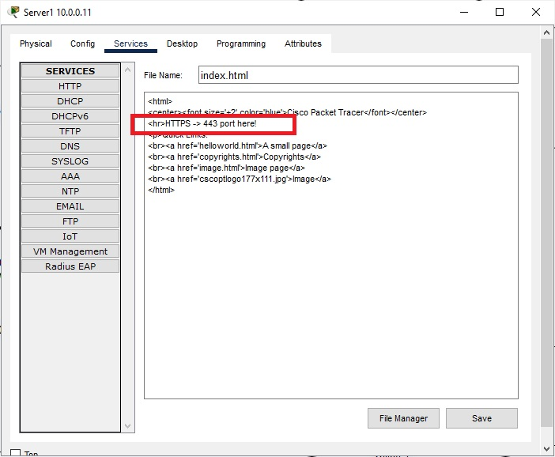
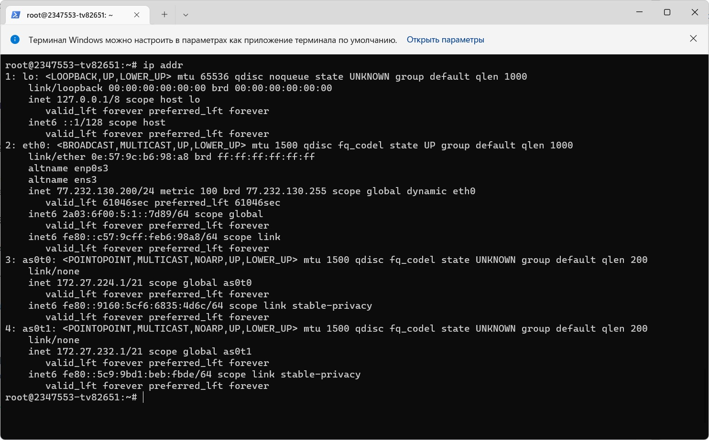

## 1. Настроенная сеть:

Office 1:
- Laptop0: 
- - IPV4: 10.1.1.10 255.255.255.0
- - GATEWAY: 10.1.1.1
- Laptop1:
- - IPV4: 10.1.1.11 255.255.255.0
- - GATEWAY: 10.1.1.1

Office 2:
- Server0:
- - IPV4: 10.0.0.10 255.255.0.0
- - GATEWAY: 10.0.0.1
- Server1:
- - IPV4: 10.0.0.11 255.255.0.0
- - GATEWAY: 10.0.0.1

Office 3:
- PC0:
- - IPV4: 172.16.0.10 255.255.0.0
- - GATEWAY: 172.16.0.1
- PC1:
- - IPV4: 172.16.0.11 255.255.0.0
- - GATEWAY: 172.16.0.1

Office 4:
- Server2:
- - IPV4: 192.168.145.5 255.255.255.0
- - GATEWAY: 1192.168.145.1

Router0:\

\

Router1:\

\

Router3:\

\

Router7:\

\

Router6:\

\

Ping c Server2 (Office 4) до Gateway (Office1, Office3, Office2):\

## Задание 1
Port Forwarding:\

Server0:\

Server1:\

## Задание 2
Router1:\
\
PC0:\

\
PC1:\

\
show ip nat translations:\

## Задание 3

## Задание 4

